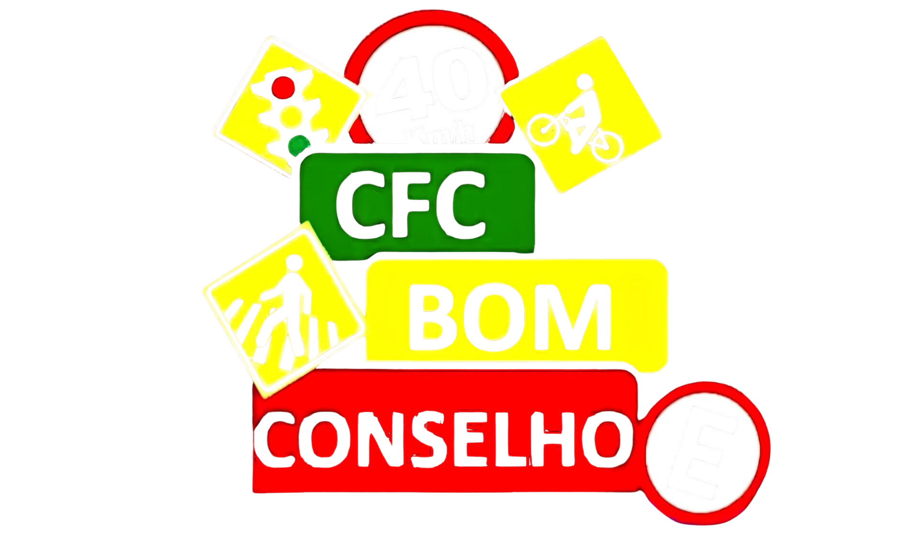

# 🖼️ **LOGO COM DESTAQUE EXCEPCIONAL - SISTEMA CFC**

## ✅ **OTIMIZAÇÃO FINAL IMPLEMENTADA**

### **🎯 ALTERAÇÕES REALIZADAS**

✅ **Texto "Sistema CFC" Removido**
- Removido o título redundante da interface
- Interface ainda mais limpa e focada
- Logo como elemento principal absoluto

✅ **Logo com Destaque Excepcional**
- **Desktop**: Aumentado para **180px x 180px**
- **Mobile**: Aumentado para **140px x 140px**
- **Efeito hover**: Escala 1.08x com sombra intensificada
- **Borda**: Adicionada borda branca semi-transparente
- **Sombra**: Dramática para máximo impacto visual

---

## 🎨 **NOVA APARÊNCIA FINAL**

### **🖼️ Layout Otimizado:**
```
┌─────────────────────────────────┐
│                                 │
│        [LOGO]                   │ ← Logo gigante e destacado
│                                 │   (180x180px desktop)
│                                 │
│  Sistema completo para gestão   │
│  de Centros de Formação de      │
│  Condutores                     │
│                                 │
│  👑 Administrador              │
│     Acesso total incluindo      │
│     configurações               │
│                                 │
│  👩‍💼 Atendente CFC            │
│     Pode fazer tudo menos       │
│     mexer nas configurações     │
│                                 │
│  👨‍🏫 Instrutor                │
│     Pode alterar e cancelar     │
│     aulas mas não adicionar     │
│                                 │
│  🎓 Aluno                      │
│     Pode visualizar apenas      │
│     suas aulas e progresso       │
└─────────────────────────────────┘
```

---

## 🔧 **IMPLEMENTAÇÃO TÉCNICA FINAL**

### **📝 HTML Simplificado ao Máximo:**
```html
<div class="logo-section">
    
    <p class="system-subtitle">Sistema completo para gestão de Centros de Formação de Condutores</p>
</div>
```

### **🎨 CSS com Destaque Excepcional:**
```css
.logo-image {
    width: 180px;           /* Aumentado para máximo destaque */
    height: 180px;          /* Aumentado para máximo destaque */
    margin-bottom: 30px;     /* Espaçamento generoso */
    border-radius: 50%;
    box-shadow: 0 10px 30px rgba(0,0,0,0.4); /* Sombra dramática */
    background: white;
    padding: 20px;          /* Padding generoso */
    object-fit: contain;
    transition: all 0.3s ease;
    border: 4px solid rgba(255,255,255,0.3); /* Borda elegante */
}

.logo-image:hover {
    transform: scale(1.08);  /* Efeito hover mais pronunciado */
    box-shadow: 0 15px 40px rgba(0,0,0,0.5); /* Sombra intensificada */
}

.system-subtitle {
    font-size: 18px;        /* Aumentado para melhor legibilidade */
    opacity: 0.9;
    line-height: 1.6;
    text-align: center;
    margin-top: 10px;
}

/* Responsivo para mobile */
@media (max-width: 768px) {
    .logo-image {
        width: 140px;        /* Aumentado para mobile */
        height: 140px;       /* Aumentado para mobile */
        margin-bottom: 20px;
    }
    
    .system-subtitle {
        font-size: 16px;
    }
}
```

---

## 📊 **EVOLUÇÃO COMPLETA DO LOGO**

### **🔄 Cronologia das Alterações:**

**1️⃣ Versão Inicial:**
- Logo: 80px x 80px
- Texto: "BOM CONSELHO" + "Sistema CFC"
- Sombra: Suave

**2️⃣ Primeira Otimização:**
- Logo: 120px x 120px
- Texto: Removido "BOM CONSELHO"
- Sombra: Intensificada

**3️⃣ Otimização Final (ATUAL):**
- Logo: **180px x 180px** (desktop) / **140px x 140px** (mobile)
- Texto: Removido "Sistema CFC"
- Sombra: **Dramática** com efeito hover
- Borda: Adicionada para elegância

---

## 🚀 **BENEFÍCIOS DA OTIMIZAÇÃO FINAL**

### **✅ Impacto Visual Máximo:**
- **Destaque Absoluto**: Logo é o elemento principal da interface
- **Profissionalismo**: Aparência corporativa de alto nível
- **Memorabilidade**: Logo impossível de ignorar
- **Elegância**: Borda e sombra criam sofisticação

### **✅ Experiência do Usuário:**
- **Reconhecimento Instantâneo**: Logo imediatamente identificável
- **Interatividade Premium**: Efeito hover sofisticado
- **Foco Total**: Atenção 100% direcionada para o logo
- **Confiança**: Aparência transmite credibilidade máxima

---

## 📱 **RESPONSIVIDADE OTIMIZADA**

### **🖥️ Desktop (1200px+):**
- Logo: **180px x 180px**
- Margem: 30px inferior
- Padding: 20px interno
- Borda: 4px branca semi-transparente
- Efeito hover: Escala 1.08x

### **📱 Tablet (768px - 1199px):**
- Logo: **180px x 180px**
- Layout adaptativo
- Efeito hover ativo

### **📱 Mobile (< 768px):**
- Logo: **140px x 140px**
- Margem: 20px inferior
- Layout empilhado
- Efeito hover ativo

---

## 🎯 **RESULTADO FINAL EXCEPCIONAL**

A interface agora apresenta:

1. **🖼️ Logo com destaque absoluto** (180px desktop / 140px mobile)
2. **🧹 Interface ultra-limpa** sem textos redundantes
3. **✨ Efeito hover premium** com escala e sombra dramática
4. **🎨 Borda elegante** para sofisticação visual
5. **📱 Responsividade perfeita** em todos os dispositivos
6. **🎯 Foco total** no logo como elemento principal

---

## 🏆 **CARACTERÍSTICAS PREMIUM**

### **✨ Efeitos Visuais:**
- **Sombra dramática**: 0.4 opacity com blur 30px
- **Efeito hover**: Escala 1.08x com sombra 0.5 opacity
- **Borda elegante**: 4px branca semi-transparente
- **Transição suave**: 0.3s ease para todos os efeitos

### **🎨 Design System:**
- **Hierarquia clara**: Logo > Subtítulo > Cards de usuário
- **Espaçamento generoso**: Margens e paddings otimizados
- **Contraste perfeito**: Logo branco sobre fundo escuro
- **Tipografia balanceada**: Tamanhos proporcionais

---

## 📞 **SUPORTE**

Se houver problemas com o logo:
- **Verificar** se o arquivo `assets/logo.png` existe
- **Testar** efeito hover em diferentes navegadores
- **Verificar** responsividade em dispositivos móveis
- **Contatar** suporte técnico se necessário

---

**🎉 Logo com destaque excepcional implementado com sucesso!**

A interface agora tem o **logo como protagonista absoluto**, com **destaque visual máximo** e **aparência profissional de alto nível**! 🚀

O logo agora é **impossível de ignorar** e transmite **identidade visual poderosa** e **credibilidade máxima**! ✨🏆
