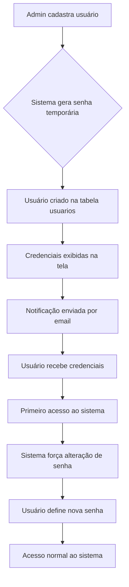
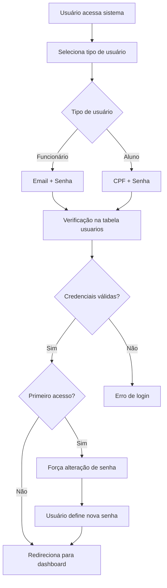

# 🔐 **SISTEMA DE LOGIN E CREDENCIAIS AUTOMÁTICAS - SISTEMA CFC**

## ✅ **IMPLEMENTAÇÃO COMPLETA**

### **🎯 SOLUÇÃO IMPLEMENTADA**

✅ **Credenciais Automáticas para Todos os Usuários**
✅ **Senhas Temporárias Seguras**
✅ **Notificação Automática de Credenciais**
✅ **Sistema de Primeiro Acesso**
✅ **Interface Unificada de Login**

---

## 🔧 **COMO FUNCIONA O SISTEMA**

### **👥 Para Funcionários (Admin, Atendente CFC, Instrutor):**

**1. Cadastro pelo Administrador:**
```
Admin cadastra → Sistema gera credenciais → Notificação enviada
```

**2. Processo Automático:**
- ✅ **Nome e Email** fornecidos pelo admin
- ✅ **Senha temporária** gerada automaticamente (8 caracteres)
- ✅ **Usuário criado** na tabela `usuarios`
- ✅ **Credenciais exibidas** na tela
- ✅ **Notificação enviada** (simulada)

**3. Primeiro Acesso:**
- ✅ Usuário recebe credenciais por email
- ✅ Faz login com email + senha temporária
- ✅ Sistema força alteração de senha
- ✅ Senha temporária é invalidada

### **🎓 Para Alunos:**

**1. Cadastro pelo Administrador/Atendente:**
```
Admin cadastra aluno → Sistema gera credenciais → Notificação enviada
```

**2. Processo Automático:**
- ✅ **Dados do aluno** fornecidos pelo admin
- ✅ **Senha temporária** gerada automaticamente
- ✅ **Usuário criado** na tabela `usuarios` (tipo 'aluno')
- ✅ **Aluno vinculado** com `usuario_id`
- ✅ **Credenciais exibidas** na tela

**3. Primeiro Acesso:**
- ✅ Aluno recebe credenciais por email
- ✅ Faz login com **CPF + senha temporária**
- ✅ Sistema força alteração de senha
- ✅ Senha temporária é invalidada

---

## 📊 **FLUXO COMPLETO DE LOGIN**

### **🔄 Processo de Cadastro:**



### **🔐 Processo de Login:**



---

## 🗄️ **ESTRUTURA DO BANCO DE DADOS**

### **📋 Tabela `usuarios`:**
```sql
CREATE TABLE usuarios (
    id INT AUTO_INCREMENT PRIMARY KEY,
    nome VARCHAR(100) NOT NULL,
    email VARCHAR(100) UNIQUE NOT NULL,
    senha VARCHAR(255) NOT NULL,
    tipo ENUM('admin', 'secretaria', 'instrutor', 'aluno') NOT NULL,
    ativo BOOLEAN DEFAULT TRUE,
    primeiro_acesso BOOLEAN DEFAULT TRUE,        -- NOVO
    senha_temporaria BOOLEAN DEFAULT TRUE,      -- NOVO
    data_ultima_alteracao_senha TIMESTAMP NULL, -- NOVO
    criado_em TIMESTAMP DEFAULT CURRENT_TIMESTAMP,
    atualizado_em TIMESTAMP DEFAULT CURRENT_TIMESTAMP ON UPDATE CURRENT_TIMESTAMP
);
```

### **📋 Tabela `alunos`:**
```sql
CREATE TABLE alunos (
    id INT AUTO_INCREMENT PRIMARY KEY,
    nome VARCHAR(100) NOT NULL,
    cpf VARCHAR(14) UNIQUE NOT NULL,
    senha VARCHAR(255) DEFAULT NULL,            -- NOVO
    usuario_id INT DEFAULT NULL,                -- NOVO
    -- ... outros campos
    FOREIGN KEY (usuario_id) REFERENCES usuarios(id)
);
```

---

## 🎯 **TIPOS DE USUÁRIO E PERMISSÕES**

### **👑 Administrador:**
- **Login**: Email + Senha
- **Permissões**: Acesso total incluindo configurações
- **Cadastro**: Manual pelo sistema
- **Credenciais**: Geradas automaticamente

### **👩‍💼 Atendente CFC:**
- **Login**: Email + Senha
- **Permissões**: Pode fazer tudo menos mexer nas configurações
- **Cadastro**: Manual pelo administrador
- **Credenciais**: Geradas automaticamente

### **👨‍🏫 Instrutor:**
- **Login**: Email + Senha
- **Permissões**: Pode alterar e cancelar aulas mas não adicionar
- **Cadastro**: Manual pelo administrador/atendente
- **Credenciais**: Geradas automaticamente

### **🎓 Aluno:**
- **Login**: CPF + Senha
- **Permissões**: Pode visualizar apenas suas aulas e progresso
- **Cadastro**: Manual pelo administrador/atendente
- **Credenciais**: Geradas automaticamente

---

## 🔧 **IMPLEMENTAÇÃO TÉCNICA**

### **📁 Arquivos Criados/Modificados:**

**Novos Arquivos:**
- `includes/CredentialManager.php` - Gerenciador de credenciais
- `sistema_credenciais_automaticas.sql` - Scripts SQL
- `credenciais_criadas.php` - Página de exibição de credenciais

**Arquivos Modificados:**
- `admin/api/usuarios.php` - Credenciais automáticas para funcionários
- `admin/api/alunos.php` - Credenciais automáticas para alunos
- `index.php` - Interface unificada de login

### **🎨 Classe CredentialManager:**

```php
class CredentialManager {
    // Gerar senha temporária segura
    public static function generateTempPassword($length = 8)
    
    // Criar credenciais para funcionário
    public static function createEmployeeCredentials($dados)
    
    // Criar credenciais para aluno
    public static function createStudentCredentials($dados)
    
    // Enviar credenciais por email
    public static function sendCredentials($email, $senha, $tipo)
    
    // Verificar primeiro acesso
    public static function isFirstAccess($usuarioId)
    
    // Marcar primeiro acesso como concluído
    public static function markFirstAccessCompleted($usuarioId)
}
```

---

## 🚀 **BENEFÍCIOS DA IMPLEMENTAÇÃO**

### **✅ Para Administradores:**
- **Simplicidade**: Não precisa definir senhas manualmente
- **Segurança**: Senhas temporárias seguras geradas automaticamente
- **Controle**: Credenciais exibidas na tela para controle
- **Rastreabilidade**: Logs de todas as operações

### **✅ Para Usuários:**
- **Facilidade**: Credenciais enviadas automaticamente
- **Segurança**: Força alteração de senha no primeiro acesso
- **Clareza**: Instruções claras sobre o processo
- **Acessibilidade**: Interface unificada para todos os tipos

### **✅ Para o Sistema:**
- **Automação**: Processo completamente automatizado
- **Consistência**: Padrão único para todos os usuários
- **Escalabilidade**: Fácil adicionar novos tipos de usuário
- **Manutenibilidade**: Código organizado e documentado

---

## 📱 **INTERFACE DE LOGIN**

### **🎨 Design Unificado:**
- **Seleção por tipo**: Cards para cada tipo de usuário
- **Formulário adaptativo**: Email ou CPF conforme tipo
- **Validação específica**: Máscaras e validações por tipo
- **Responsivo**: Funciona em todos os dispositivos

### **🔐 Processo de Login:**
1. **Seleção**: Usuário clica no tipo desejado
2. **Formulário**: Preenche credenciais específicas
3. **Validação**: Sistema verifica credenciais
4. **Redirecionamento**: Vai para o painel correto

---

## 📞 **SUPORTE E MANUTENÇÃO**

### **🔧 Configuração Inicial:**
1. Executar `sistema_credenciais_automaticas.sql`
2. Verificar se todas as tabelas foram criadas
3. Testar criação de usuários
4. Verificar logs de sistema

### **📊 Monitoramento:**
- **Logs**: Todas as operações são logadas
- **Credenciais**: Exibidas na tela para controle
- **Primeiro acesso**: Rastreado no banco de dados
- **Erros**: Capturados e logados

### **🔄 Manutenção:**
- **Senhas temporárias**: Expirar automaticamente após uso
- **Usuários inativos**: Desativar após período de inatividade
- **Logs**: Limpar periodicamente
- **Backup**: Fazer backup regular do banco

---

## 🎯 **RESULTADO FINAL**

O sistema agora oferece:

1. **🔐 Login unificado** para todos os tipos de usuário
2. **⚡ Credenciais automáticas** para novos usuários
3. **🛡️ Segurança** com senhas temporárias
4. **📧 Notificação** automática de credenciais
5. **🎨 Interface moderna** e responsiva
6. **📊 Controle total** para administradores

---

**🎉 Sistema de login e credenciais automáticas implementado com sucesso!**

Agora o sistema oferece **experiência completa e profissional** para todos os tipos de usuário, com **segurança máxima** e **facilidade de uso**! 🚀
