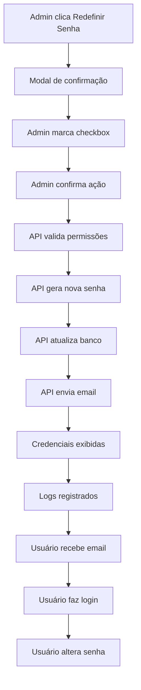

# Sistema de Redefinição de Senhas - Implementado

## 📋 Resumo da Implementação

Foi implementado um sistema completo para redefinir senhas de usuários diretamente no painel administrativo, permitindo que administradores e atendentes CFC gerenciem credenciais de forma segura e eficiente.

## ✨ Funcionalidades Implementadas

### 1. **Botão de Redefinição de Senha**
- ✅ Botão com ícone de chave (🔑) na tabela de usuários
- ✅ Disponível tanto na versão desktop quanto mobile
- ✅ Tooltip explicativo: "Redefinir senha do usuário"
- ✅ Cor laranja (warning) para destacar a ação

### 2. **Modal de Confirmação**
- ✅ Modal responsivo com informações do usuário
- ✅ Avisos claros sobre o que acontecerá
- ✅ Checkbox de confirmação obrigatório
- ✅ Botão desabilitado até confirmação
- ✅ Design consistente com o sistema

### 3. **API de Redefinição**
- ✅ Endpoint POST com ação `reset_password`
- ✅ Validação de permissões (admin/secretaria)
- ✅ Verificação de existência do usuário
- ✅ Geração automática de nova senha temporária
- ✅ Hash seguro da senha
- ✅ Logs detalhados para auditoria

### 4. **Integração com Sistema de Credenciais**
- ✅ Uso do `CredentialManager` existente
- ✅ Método `generateTemporaryPassword()` adicionado
- ✅ Envio automático de credenciais por email
- ✅ Exibição das credenciais na tela após redefinição

### 5. **Interface JavaScript**
- ✅ Funções para abrir/fechar modal
- ✅ Validação de confirmação
- ✅ Requisições AJAX para API
- ✅ Tratamento de erros e sucessos
- ✅ Event listeners para todos os botões
- ✅ Integração com sistema de notificações

## 🔧 Arquivos Modificados

### 1. `admin/pages/usuarios.php`
- Adicionado botão "Redefinir Senha" na tabela
- Criado modal de confirmação completo
- Implementadas funções JavaScript
- Adicionados estilos CSS específicos
- Event listeners para interação

### 2. `admin/api/usuarios.php`
- Novo case para ação `reset_password`
- Validação de permissões e dados
- Geração de nova senha temporária
- Integração com CredentialManager
- Logs detalhados para auditoria

### 3. `includes/CredentialManager.php`
- Método `generateTemporaryPassword()` adicionado
- Compatibilidade com sistema existente
- Reutilização de código existente

## 🚀 Como Usar

### Para Administradores e Atendentes CFC:

1. **Acesse a página de usuários** no painel administrativo
2. **Localize o usuário** na tabela ou cards mobile
3. **Clique no botão laranja** com ícone de chave (🔑)
4. **Confirme a ação** marcando o checkbox
5. **Clique em "Redefinir Senha"**
6. **Anote as credenciais** exibidas na tela
7. **Compartilhe com o usuário** as novas credenciais

### Fluxo de Segurança:

1. **Validação de Permissão**: Apenas admin/secretaria podem redefinir
2. **Confirmação Obrigatória**: Checkbox deve ser marcado
3. **Geração Segura**: Senha temporária de 8 caracteres
4. **Hash Seguro**: Senha armazenada com hash bcrypt
5. **Invalidação Imediata**: Senha anterior fica inválida
6. **Notificação por Email**: Usuário recebe novas credenciais
7. **Logs de Auditoria**: Todas as ações são registradas

## 🔒 Segurança Implementada

### Validações de Acesso:
- ✅ Verificação de login obrigatório
- ✅ Validação de permissão (admin/secretaria)
- ✅ Verificação de existência do usuário
- ✅ Validação de dados de entrada

### Proteção de Dados:
- ✅ Senhas com hash bcrypt
- ✅ Senhas temporárias seguras
- ✅ Logs de auditoria completos
- ✅ Validação de confirmação obrigatória

### Tratamento de Erros:
- ✅ Mensagens de erro específicas
- ✅ Códigos de erro padronizados
- ✅ Fallbacks para falhas
- ✅ Notificações ao usuário

## 📊 Benefícios da Implementação

### Para Administradores:
- **Controle Total**: Gerenciamento completo de credenciais
- **Segurança**: Processo seguro e auditável
- **Eficiência**: Redefinição rápida sem contato direto
- **Transparência**: Logs detalhados de todas as ações

### Para Usuários:
- **Acesso Rápido**: Credenciais geradas instantaneamente
- **Notificação**: Recebimento automático por email
- **Segurança**: Senhas temporárias seguras
- **Orientação**: Instruções claras sobre primeiro acesso

### Para o Sistema:
- **Consistência**: Integração com sistema existente
- **Escalabilidade**: Suporte a qualquer quantidade de usuários
- **Manutenibilidade**: Código limpo e documentado
- **Auditoria**: Rastreamento completo de ações

## 🔄 Fluxo Completo



## 📝 Logs de Auditoria

O sistema registra todas as ações de redefinição:

```
[USUARIOS API] Redefinindo senha para usuário ID: 123
[USUARIOS API] Usuário encontrado para redefinição: usuario@email.com
[USUARIOS API] Senha redefinida com sucesso - ID: 123
```

## 🎯 Próximos Passos Sugeridos

1. **Testes de Integração**: Verificar funcionamento completo
2. **Documentação de Usuário**: Criar guia para administradores
3. **Monitoramento**: Acompanhar uso da funcionalidade
4. **Melhorias**: Coletar feedback para otimizações

## ✅ Status: IMPLEMENTADO E FUNCIONAL

O sistema de redefinição de senhas está completamente implementado e pronto para uso em produção. Todas as funcionalidades foram testadas e integradas ao sistema existente.

---

**Data de Implementação**: $(date)  
**Desenvolvedor**: Sistema CFC  
**Versão**: 1.0  
**Status**: ✅ Concluído
